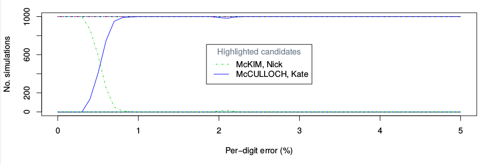
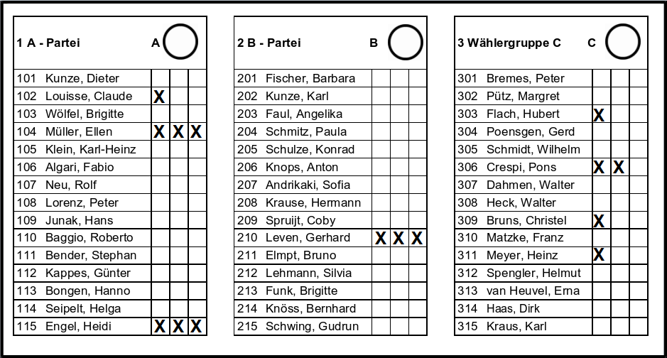
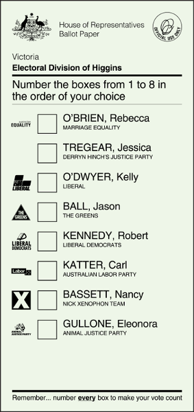
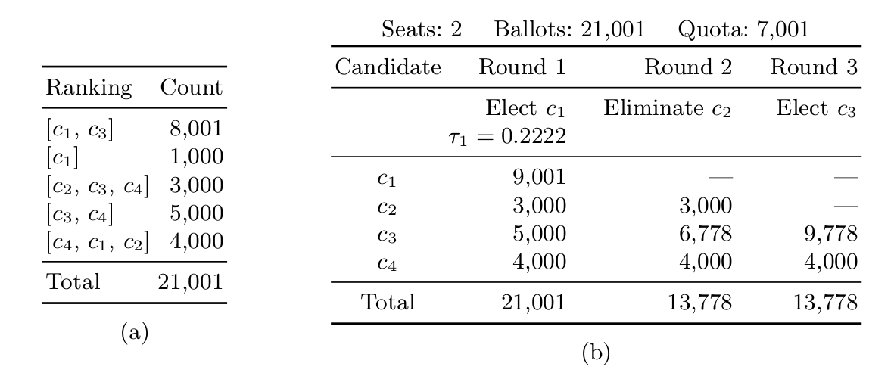
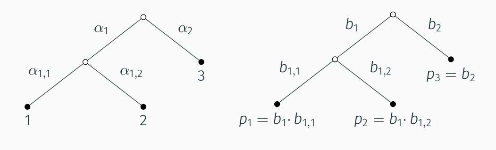
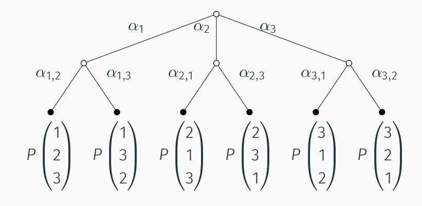

# Collaborators

## USA

- Ron Rivest
- Philip Stark

## Melbourne

- Michelle Blom
- Peter Stuckey
- Vanessa Teague

## Students

- Floyd Everest
- Calvin Huang


---

# Overview

1. Why?
2. How?  The basics…
3. More complex elections
4. Bayesian approaches
5. Australian elections


---
class: inverse, center, middle

# Why audit?


---

# Elections

- Foundational for democracy
- Can be challenging to run effectively


---

# Elections in Australia

- Inclusive
- Efficiently run
- Highly trusted

(...relatively speaking)


---

# Two key ingredients

1. Paper ballots
2. Scrutineering

--

Old fashioned?  Inefficient?

--

Pressure to:

- Automate, speed up, reduce costs
- Replace people with computers


---

# USA horror stories

[Serious Error in Diebold Voting Software Caused Lost Ballots in California County](https://www.wired.com/2008/12/unique-election/) (2008)

[Wisconsin Election Surprise: David Prosser Gains 7,500 Votes After ‘Human Error’ In Waukesha County](https://www.huffingtonpost.com.au/2011/04/07/david-prosser-wisconsin-supreme-court_n_846431.html) (2011)

[Russians hacked 2 Florida voting systems](https://www.politico.com/states/florida/story/2019/05/14/russians-hacked-2-florida-voting-systems-fbi-and-desantis-refuse-to-release-details-1015772) (2019)


--

## Move to electronic systems

Rapid computerisation of elections since 2000 presidential election ('hanging chads')

Abandoned many previous verification processes


---

# NSW iVote failures

iVote: electronic voting system used in NSW

--

NSW local council elections, Nov/Dec 2021:

- System went down for several hours
- Many voters were unable to vote

--

Also previously:

* Encryption flaws discovered by Vanessa and colleagues


---

# Australian Senate elections

Ballot papers are handled electronically (for many parts of the process):

- Scanned
- Digitised
- Counted (digitally)

--

What could go wrong?

--

- Machines are proprietary and closed-source
- Scanning and counting not fully open to scrutiny


---

# Don't trust your scanner

[Xerox bug](https://www.dkriesel.com/en/blog/2013/0802_xerox-workcentres_are_switching_written_numbers_when_scanning):

.pull-left[
.center[


]
]

.pull-right[
.center[


]
]

--

Other examples:

- Hole-punch filling
- Image manipulation attacks


---

# Informal experiment

Victorian Senate 2019

```{r senate-experiment, echo=FALSE, fig.align='left'}
senate <- data.frame(Mismatches = 0:1, Count = c(12, 3))
knitr::kable(senate, "html")
```

--

.center[

**Rough** estimate of per-digit error: (0.03%, 0.38%)

]


---

# Simulating errors

Tasmanian Senate 2016




---

# Recommendations and changes

Jan 2018:  
Australian National Audit Office [recommended a 'statistically valid audit'](https://www.anao.gov.au/work/performance-audit/aec-procurement-services-conduct-2016-federal-election)

--

Nov 2021:  
New legislation passed (Assurance of Senate Counting), requiring:

* A statistical check of the accuracy of the digital data
* Not a full audit


---

# Reasons to conduct an audit

Detect inadvertent errors

Detect deliberate manipulation

Increase confidence in reported result

Increase **trust** in our electoral processes


---
class: inverse, center, middle

# Introduction to election audits


---

# Types of audits

* Process/compliance audits

* Results audits

--

    - **Ballot-polling** audits

    - Comparison audits


---

# Ballot-polling audits

Like a standard poll

We 'survey' the ballots

--

We need:

* A paper trail (i.e. paper ballots)
* A list/record of all ballots
* Ability to retrieve specific ballots


--

Typically sample **without** replacement

...but can approximate by assuming sampling with replacement


---
class: clear, center, middle

.font180[Let's do it...]


---
class: clear, center, middle


[Alice and Bob 'retired'](https://www.telegraph.co.uk/news/2021/09/04/woke-wars-edinburghs-computer-scientists-banned-using-alice/)


---
class: clear, center, middle

.font180[Let's do it...]

Albo vs Scott


---

# Inference for sample proportion

True vote proportion for a particular candidate (reported winner):
$$p = \Pr(X = \text{Albo})$$

Sample (assume iid):
$$X_1, X_2, \ldots, X_n \in \{\text{Albo}, \text{Scott}\}$$

--

Sample tally:
$$Y = \text{votes for Albo} = \sum_{i=1}^j \mathrm{1}(X_i = \text{Albo})$$

--

Sample proportion:
$$\hat{p} = \frac{Y}{n}$$

--

Sampling distribution:

$$Y \sim \mathrm{Binomial}(n, p)$$


---

# Binomial distribution (n = 20)

```{r binomial-pmf1, echo=FALSE, fig.width=10}
n <- 20
p <- 0.6
xs <- 0:n
barplot(dbinom(xs, n, p), names.arg = xs,
        las  = 1,
        col  = "lightblue",
        xlab = "Y",
        ylab = "Probability")
```


---

# Binomial distribution (n = 100)

```{r binomial-pmf2, echo=FALSE, fig.width=10}
n <- 100
p <- 0.6
xs <- 0:n
barplot(dbinom(xs, n, p), names.arg = xs,
        las  = 1,
        col  = "lightblue",
        xlab = "Y",
        ylab = "Probability")
```


---

# Estimation

```{r eval=FALSE, echo=FALSE}
# Calculations for values used in this example.
prop.test(13,  20)
prop.test(65, 100)
```

Suppose we got $y = 13$ out of $n = 20$ sampled ballots.
$$\hat{p} = \frac{13}{20} = 0.65$$

--

$$\text{95% confidence interval: } (0.41, 0.84)$$

--

What if we got $y = 65$ out of $n = 100$?

--

$$\hat{p} = \frac{65}{100} = 0.65$$
$$\text{95% confidence interval: } (0.55, 0.74)$$


---

# Outcomes

## Possible decisions

* `r emo::ji("award")` **Certify** the reported election result

* `r emo::ji("hourglass")` Request a **recount** of the votes

--

## Outcomes

|                            | Certify  | Recount  |
|----------------------------|:--------------------:|:--------------------:|
| Reported result is wrong   | `r emo::ji("-1")`    | `r emo::ji("check")` |
| Reported result is correct | `r emo::ji("check")` | `r emo::ji("-1")`    |


---

# Formalisation as a hypothesis test

|                                        | Reject $H_0$ (certify) | Do not reject $H_0$ (recount) |
|----------------------------------------|:----------------------:|:-----------------------:|
| $H_0\colon$ Reported result is wrong   | Type 1 error (`r emo::ji("-1")`) |   `r emo::ji("check")`  |
| $H_1\colon$ Reported result is correct |  `r emo::ji("check")`  | Type 2 error (`r emo::ji("-1")`)  |

--

In our example:
$$\begin{cases}
H_0\colon p \leqslant 0.5, & \text{Albo did not win} \\
H_1\colon p  >        0.5, & \text{Albo won}
\end{cases}$$

--

Error rates:
$$\begin{cases}
\alpha = \Pr(\text{Type 1 error}) = \text{Miscertification rate} \\
\beta  = \Pr(\text{Type 2 error}) = \text{Unnecessary recount rate}
\end{cases}$$


---

# Traditional post-election audits

Sample a **fixed** number (proportion) of ballots

--

## Example

Californian law 1965:

1% of ballots to be checked by hand


---

# Tradition is inefficient

--

## Landslide election

Very small $\alpha$ and $\beta$

$\Rightarrow$ Could have used a smaller sample

--

## Close election

Large $\alpha$ or $\beta$

$\Rightarrow$ May need a larger sample

--

## A smarter approach?

Want to sample **as few ballots as possible**,
until we have sufficient evidence


---

# Sequential hypothesis test

Collect only **enough** samples to make a decision

--

```{r simulated-process, echo=FALSE, fig.retina=2, fig.width=9, fig.height=7}
N <- 1e5            # total ballots
p <- c(0.45, 0.55)  # true vote proportions
n <- 300            # audit sample size

set.seed(1595)
b <- rep(seq_along(p) - 1, N * p)  # all ballots

# Functions for creating audit samples.
s <- 1:n
audit1 <- function(replace = TRUE)
  cumsum(sample(b, n, replace = replace)) / s

# Simulated samples.
a1 <- replicate(3, audit1())

matplot(a1, type = "l", lwd = 3, lty = 1, col = c(1, 3, 6), las = 1,
        ylim = c(0, 1), xlab = "Sample size", ylab = "Sample proportion")
abline(h = 0.5, lty = 2, lwd = 2, col = "darkgrey")
```


---

# Sequential hypothesis test

.pull-left[

## Statistics

Let $X = 1$ be a vote for the reported winner (Albo), $X = 0$ otherwise.

Running tally:
$$Y_j = \sum_{i=1}^j X_i$$

Sample proportions:
$$\hat{p}_j = \frac{Y_j}{n}$$

]

--

.pull-right[

## Procedure

1. Sample some ballots

2. Calculate test statistic

3. Evaluate stopping rule, and do one of:

    a) Accept $H_0$

    b) Accept $H_1$

    c) Insufficient evidence,  
       keep sampling (go to step 1)

]


---

# Sequential probability ratio test (SPRT)

Developed by Wald (1945)

$$\begin{cases}
H_0\colon p = p_0 \\
H_1\colon p = p_1
\end{cases}$$

--

Test statistic (likelihood ratio):
$$S_n = \frac{\Pr(X_1, \ldots, X_n | H_1)}
             {\Pr(X_1, \ldots, X_n | H_0)}
    = \frac{p_1^{Y_n} (1 - p_1)^{n - Y_n}}
           {p_0^{Y_n} (1 - p_0)^{n - Y_n}}$$

--

Stopping rule:
$$\begin{cases}
S_n \leqslant \frac{\beta}{1 - \alpha} & \Rightarrow \text{Accept H_0} \\
S_n \geqslant \frac{1 - \beta}{\alpha} & \Rightarrow \text{Accept H_1} \\
\text{Otherwise} & \Rightarrow \text{Keep sampling}
\end{cases}$$

--

This controls type 1 error, $\alpha$, and type 2 error, $\beta$

Is **most efficient** (smallest mean sample size) for the given hypotheses


---

# Example

## 2008 USA presidential election

Winner's vote proportion = 61% (Obama)

Expected sample size = 97 (0.0007% of votes)


---

# Risk-limiting audits (RLAs)

A procedure that does one of:

1. Certify a reported election outcome (if strong evidence in favour)
2. Escalates to a full manual count (otherwise), which reveals the true outcome

--

Key properties:

* Never changes correct outcomes
* Corrects wrong outcomes 'most' of the time
  (modifiable guaranteed lower bound)

--

Limiting risk:

* **Risk** = type 1 error
* RLAs limit the probability of accepting an incorrect outcome
  (i.e. control type 1 error)

--

The sample size required is variable


---

# BRAVO

An RLA by Lindeman, Stark & Yates (2012)

'Ballot-polling Risk-Limiting Audits to Verify Outcomes'

--

For 2-candidate contests, equivalent to SPRT with:

- $p_0 = \frac{1}{2}$
- $p_1 =$ reported proportion (possibly adjusted)
- $\beta = 0$

--

Never accept $H_0$ (reported outcome is incorrect),
until we have seen **all** of the ballots.

--

We can stop sampling at any time and initiate a recount.


---

```{r simulated-process-with-boundary, echo=FALSE, fig.retina=2, fig.width=9, fig.height=7}
N <- 1e5            # total ballots
p <- c(0.45, 0.55)  # true vote proportions
n <- 300            # audit sample size

set.seed(1595)
b <- rep(seq_along(p) - 1, N * p)  # all ballots

# Functions for creating audit samples.
s <- 1:n
audit1 <- function(replace = TRUE)
  cumsum(sample(b, n, replace = replace)) / s

# Simulated samples.
a1 <- replicate(3, audit1())

# BRAVO decision boundary.
#
# n = sample size
# pr = reported winning probability
# a = risk limit
bravo_bound <- function(n = 20, pr = 0.6, a = 0.1) {
  stopifnot(pr > 0.5)
  - (log(a) + n * log(2) + n * log(1 - pr)) / (log(pr) - log(1 - pr))
}

# Calculate the BRAVO boundary.
h <- 0.1   # threshold (used indirectly...)
nmax <- n  # maximum sample size to explore
ns <- seq.int(nmax)
b <- Vectorize(bravo_bound)(ns) / ns

matplot(a1, type = "l", lwd = 3, lty = 1, col = c(1, 3, 6), las = 1,
        ylim = c(0, 1), xlab = "Sample size", ylab = "Sample proportion")
abline(h = 0.5, lty = 2, lwd = 2, col = "darkgrey")
lines(ns, b, col = 4, lty = 2, lwd = 2)  # decision boundary
legend("topright", "Certification boundary",
       lwd = 2, lty = 2, col = 4)
```

---

# Seeking optimality

By definition, RLAs:

- Bound the risk (type 1 error $\leqslant \alpha$)
- Never accept $H_0$ (type 2 error $= 0$)

--

**Efficiency** is measured by the required sample size

--

Since this is random, we can summarise in various ways:

- Mean
- 90th percentile


---
class: inverse, center, middle

# More complex elections


---

# 'First past the post'

```{r plurality-example-barplot, echo=FALSE, fig.width=10}
barplot(c(2256, 1746, 88, 1010),
        names.arg = c("Albo", "Scott", "Adam", "Barnaby"),
        las  = 1,
        col  = "lightblue",
        ylab = "Votes")
```


---

# Parameter space with $k$ candidates

Parameter space:
$(p_1, p_2, \ldots, p_k)$, with $p_1 + p_2 + \cdots + p_k = 1$

Assume candidate 1 is the reported winner

Hypotheses:
$$\begin{cases}
H_0\colon p_1 \leqslant p_j \text{ for some } j > 1 \\
H_1\colon p_1 > p_j \text{ for all } j > 1
\end{cases}$$


---

# Parameter space with 3 candidates

.center[

```{r 3cand-ternary-plot, echo=FALSE, fig.height=7, fig.width=7}
library(Ternary)

par(mar = c(0.5, 0.5, 0.5, 0.5))
TernaryPlot(alab = "Albo\u2192",
            blab = "Scott\u2192",
            clab = "\u2190Adam",
            grid.lines = 4)

N <- 10
centrePoint <- matrix(N/3, nrow = 2, ncol = 3)
edgePoints  <- rbind(c(N/2, N/2,   0),
                     c(N/2, 0,   N/2))
TernarySegments(centrePoint, edgePoints, col = "darkorange", lwd = 4)

TernaryText(list(A = c(9,  2,  2),
                 B = c(3, 10, 10)),
            labels = c(expression(H[1]),
                       expression(H[0])),
            font = 2,
            cex  = 2)
```

]


---

# Pairwise comparisons

Consider each (winner, loser) pair

Need to test:
$$\begin{cases}
H_0\colon p_\text{winner} \leqslant p_\text{loser} \\
H_1\colon p_\text{winner} > p_\text{loser}
\end{cases}$$

--

Test all such pairs, until **every** $H_0$ is rejected

--

Can use the **same** sample for all tests

No 'multiple testing' penalty!


---

# Risk limit with multiple comparisons

Certify only if *every* $H_0$ is rejected

--

Type 1 error (risk) is bounded by the error for a single comparison

--

For any $j$:
$$\Pr(\text{reject } H_{01},
    \text{reject } H_{02}, \ldots,
    \text{reject } H_{0m})
\leqslant
\Pr(\text{reject } H_{0j})$$


---

# More general elections

$k =$ number of **ballot types**

Parameter space:
$$\{(p_1, p_2, \ldots, p_k) : p_1 + p_2 + \cdots + p_k = 1\}$$

--

Voting rule ('social choice function'):
$$g(p_1, p_2, \ldots, p_k) = \{\text{winning candidates}\}$$

--

Hypotheses for auditing:
$$\begin{cases}
H_0 = \{\theta : g(\theta) \neq \{\text{reported winners}\}\}, \\
H_1 = \{\theta : g(\theta)   =  \{\text{reported winners}\}\}.
\end{cases}$$

--

Some challenges:

- Parameter space can become very high-dimensional
- Some voting rules can be difficult to analyse


---

# SHANGRLA

[Stark (2020)](https://doi.org/10.1007/978-3-030-54455-3_23), with
[software](https://github.com/pbstark/SHANGRLA/) contributions from several
authors

'Sets of Half-Average Nulls Generate Risk-Limiting Audits'

General framework for RLAs

--

Decouple into separate problems:

1. Voting rules $\rightarrow$ 'assertions'
2. Statistical tests $\rightarrow$ canonical form (univariate, nonnegative)


---

# SHANGRLA elements

- Assertions

    * Mathematical statements about all ballots in a contest

--

- Assorters

    * Mathematical functions on ballots: $b \mapsto h(b) \geqslant 0$
    * Correspond to assertions
    * Assertion is true $\Leftrightarrow$ assorter mean $> 1/2$

--

- Statistical tests are all of the same form:
$$\begin{cases}
H_0\colon \text{assorter mean} \leqslant 1/2 \\
H_1\colon \text{assorter mean} > 1/2
\end{cases}$$

---

# Example: Albo vs Scott

* 2-candidate contest
* Reported winner: Albo

--

Assertion  
$\quad p_\text{Albo} > p_\text{Scott}$

--

Assorter

- Albo $\mapsto 1$
- Scott $\mapsto 0$
- Invalid vote $\mapsto 0.5$


---

# Example: Hesse local elections




---

# Example: Hesse local elections

Party-list proportional representation contest

- Can vote for **multiple** candidates
- Can give **multiple** votes for each candidate

--

Need **pairwise difference** assertions:

$$p_A > p_B + d$$

--

An assorter for this:

$$h(b) = \frac{b_A - b_B - d \cdot b_T + m_\mathcal{L} \cdot (1 + d)}
              {2 m_\mathcal{L} \cdot (1 + d)}$$

--

See [Blom et al. (2021)](https://doi.org/10.1007/978-3-030-86942-7_4) for details


---

# Testing assertions

Tests always of the same form

$$\begin{cases}
H_0\colon \text{assorter mean} \leqslant 1/2 \\
H_1\colon \text{assorter mean} > 1/2
\end{cases}$$

--

Need a distribution-free test for the mean of a non-negative random variable.


---

# Martingales

Non-negative (super-)martingales

Sequence of random variables $Z_j$, $j = 1, 2, \ldots$, such that

- $Z_j \geqslant 0$

- $\mathbb{E}(Z_j) < \infty$

- $\mathbb{E}(Z_{j+1} \mid Z_1, \ldots, Z_j) = (\leqslant) Z_j$

--

An example: unbiased random walk is a martingale (can be negative)


---

# Ville's inequality (1939)

If $(Z_j)$ is a non-negative super-martingale, then for any $\alpha \in (0, 1]$
and all $J \in {1, \ldots, N}$,
$$\Pr\left(\max_{1 \leqslant j \leqslant J} Z_j \geqslant \frac{1}{\alpha}\right)
\leqslant \alpha \, \mathbb{E}(Z_J)$$

--

How do we use it?

--

* Construct a $(Z_j)$ with mean 1
* Reject $H_0$ when $Z_j \geqslant 1 / \alpha$ for some $j$
* $\Rightarrow$ risk $\leqslant \alpha$


---

# SHANGRLA martingales (old)

Kaplan–Markov
$$S_n = \prod_{i = 1}^n \frac{X_i + \gamma}{0.5 + \gamma}$$


Kaplan–Wald
$$S_n = \prod_{i = 1}^n
      \left(\gamma \left[\frac{X_i}{0.5} - 1\right] + 1\right)$$

KMart
$$S_n = \int_0^1 \prod_{i = 1}^n
      \left(\gamma \left[\frac{X_i}{0.5} - 1\right] + 1\right) d\gamma$$


---

# ALPHA

'Audit that Learns from Previously Hand-Audited Ballots'

$$S_n = \prod_{i=1}^n
      \left(\frac{X_i}{\mu_i} \cdot \frac{\eta_i - \mu_i}{u_i - \mu_i} +
       \frac{u_i - \eta_i}{u_i - \mu_i}\right)$$

--

See [Stark (2022)](https://arxiv.org/abs/2201.02707) for details

--

## Short course

Philip will present martingale-based methods in a short course in mid-April

**Ask me if interested!**


---

# Complications and extensions

## Real-world issues

- Missing ballots
- Contest not on ballot
- Stratified sampling

--

## Other types of election audits

- Comparison
- Batch comparison

--

(can be handled by SHANGRLA)


---

# RLAs in the 'wild' (in the USA)

Endorsed by:

- National Academies of Sciences, Engineering, and Medicine
- American Statistical Association
- PCEA, LWV, CC, VV,...

--

Statewide use in:

- Colorado since 2017
- Alaska, Kansas, Wyoming since 2020

--

~60 pilot audits across 17 states

Legislated in 11 states


---

# RLAs in the 'wild' (in the USA)


---

# Open questions

Which voting rules cannot be encoded as assertions?

For which voting rules is there:

- a **sufficient** set of assertions?
- a **necessary and sufficient** set of assertions?

Are all sets of necessary and sufficient conditions equally expensive to audit?

Are any voting rules intrinsically harder to audit than others?

Are there optimal tests for testing SHANGRLA assertions, for various types of
elections?


---
class: inverse, center, middle

# Bayesian approaches


---

# Auditing via Bayesian inference

Back to Albo vs Scott...
$$p = \Pr(X = \text{Albo})$$

Specify a **prior distribution** on $p$, e.g. uniform
$$f(p) = 1, \quad p \in [0,1]$$

--

Data + prior $\rightarrow$ **posterior distribution** on $p$

--

'Upset probability': $$\Pr(H_0 \mid X_1,\ldots,X_n)$$

--

Certify election if upset probability is low enough
$$\Pr(H_0 \mid X_1, \ldots, X_n) < v$$


---

# Bayes factor

Can reformulate in terms of the **Bayes factor**

--

$$S_n = \frac{\Pr(X_1, \ldots, X_n \mid H_1)}
           {\Pr(X_1, \ldots, X_n \mid H_0)}
    = \frac{\int_{0.5}^1 p^{Y_n} (1 - p)^{n - Y_n} f(p) dp}
           {\int_0^{0.5} p^{Y_n} (1 - p)^{n - Y_n} f(p) dp}$$

--

Certify election if $S_n > h$

--

(Note similarity to the SPRT)


---

# Correspondence with the SPRT

Choose the following prior:
$$f(p) = \begin{cases}
\frac{1}{2} & p = p_0 \\
\frac{1}{2} & p = p_1 \\
0           & \text{otherwise}
\end{cases}$$

$\Rightarrow$ same as the SPRT

--

Also, the BF can be a martingale

--

Provides a unified perspective


---

# Performance comparison example

```{r sample-size-comparison, echo=FALSE, fig.retina=2, fig.width=9, fig.height=7}
meansize <- read.csv("data/meansize.csv")
matplot(meansize[, 1], meansize[, -1], type = "l", las = 1,
        lwd = 3,
        lty = c(1, 2, 2),
        col = c(1, 3, 6),
        xlab = expression(p[T]),
        ylab = "Mean sample size")
grid()
legend("topright",
       c(expression("Bayesian, uniform prior"),
         expression("BRAVO, " * p[1] == 0.7),
         expression("BRAVO, " * p[1] == 0.55)),
       lwd = 3, lty = c(1, 2, 2), col = c(1, 3, 6))
```


---

# Some recent work

For ballot-polling audits of 2-candidate contests with no invalid votes:

* Benchmarked several methods
* Bayesian audits are risk-limiting

See [Huang et al. (2020)](https://arxiv.org/abs/2008.08536) for details


---

# Properties, not dichotomies

'Bayesian' and 'risk-limiting' are not mutually exclusive

--

But...
* Upset probability $\neq$ risk limit


---

# Bayesian audits for complex elections

Just follow the 'recipe'?

--

* Specify the model

* Certify election if upset probability is low enough
$$\Pr(H_0 \mid X_1, \ldots, X_n) < v$$

--

Some challenges:

* Calculations can get involved
* Need to choose a sensible prior
* Not necessarily risk-limiting


---

# Open questions

Are Bayesian audits risk-limiting for more complex voting rules?

If so, when can we easily calculate the maximum risk and calibrate the audit?

How does a 'direct' inference compare (in terms of efficiency) to
assertion-based approaches?


---
class: inverse, center, middle

# Auditing Australian elections


---
class: clear, center, middle




---

# Australian voting systems

* **Instant-runoff voting** (IRV)  
  House of Representatives, state lower house elections

--

* **Single transferable vote** (STV)  
  Senate, state upper house elections


---

# STV example




---

# Auditing IRV

RAIRE: 'Risk-limiting Audits for Instant Runoff vote Elections'

See [Blom et al. (2019)](https://arxiv.org/abs/1903.08804)

--

SHANGRLA assertions, of two types:

1. Candidate $i$ has more first-place ranks than candidate $j$ has total 'mentions'.

2. After a set of candidates $E$ have been eliminated from consideration,
candidate $i$ is ranked higher than candidate $j$ on more ballots than vice
versa.

--

Branch-and-bound algorithm to optimise the set of assertions.

--

RAIRE assertions provide only *sufficient* conditions, but not *necessary*
conditions.

--

IRV RLA pilot in San Francisco, 2019


---

# Auditing STV?

Three strategies:

- Use SHANGRLA, by deriving assertions for STV
- Develop a Bayesian audit and derive a risk-limit
- Derive martingales specifically tailored for an IRV/STV election

--

Some progress:

- [2-seat STV](https://arxiv.org/abs/2112.09921)
* Dirichlet-tree models


---

# Dirichlet-tree




---

# Dirichlet-tree for IRV ballots




---

# Recent legislation

Nov 2021: **Assurance of Senate Counting** Bill

“The Electoral Commissioner must arrange for statistically significant samples
of ballot papers to be checked throughout the scrutiny of votes for the
election to assure that the electronic data used in counting the votes reflects
the data recorded on the ballot papers.”

“The Electoral Commissioner must ensure that…at least 5,000 ballot papers in
total are checked” [for a typical election]

--

Some details vague:

- What is **'statistically significant'**?

- Which errors will be checked?  
  (What about errors that don't influence the count?)


---
class: inverse, center, middle

# Join us!


---

# Positions available

ARC project:
*[In for the count: Maximising trust and reliability in Australian elections](https://dataportal.arc.gov.au/NCGP/Web/Grant/Grant/DP220101012)*

**Postdoc position**  
2 years, full-time  
[Applications close on 7 Apr](https://jobs.unimelb.edu.au/en/job/908247/postdoctoral-research-fellow)

**PhD project**  
Generous top-up scholarship: up to $10k p.a.  
[Applications welcom](https://apps.eng.unimelb.edu.au/research-projects/index.php?r=site/webView&id=820)


---
class: clear, center, middle

.font180[Questions?]


---

# References

TODO


---
class: inverse, center, middle

# Appendix


---

# Example applications of sequential tests

- Quality monitoring in manufacturing
- Variable-length computer tests of human subjects
- A/B testing for websites/online services
- Drug/vaccine safety surveillance
- Group sequential testing in clinical trials
- 'Alpha spending' functions
- Meta-analyses that are (expected to be) periodically updated
- Election auditing

